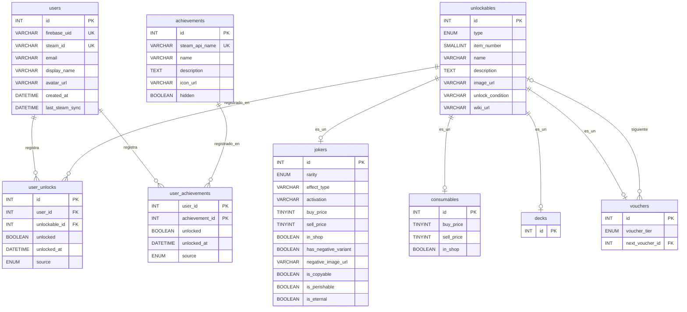

```mermaid
erDiagram
    users ||--o{ user_unlocks : "registra"
    unlockables ||--o{ user_unlocks : "registrado_en"
    unlockables ||--o| jokers : "es_un"
    unlockables ||--o| consumables : "es_un"
    unlockables ||--o| decks : "es_un"
    unlockables ||--o| vouchers : "es_un"
    vouchers }o--o| unlockables : "siguiente"
    users ||--o{ user_achievements : "registra"
    achievements ||--o{ user_achievements : "registrado_en"

    users {
        INT id PK
        VARCHAR firebase_uid UK
        VARCHAR steam_id UK
        VARCHAR email
        VARCHAR display_name
        VARCHAR avatar_url
        DATETIME created_at
        DATETIME last_steam_sync
    }

    unlockables {
        INT id PK
        ENUM type
        SMALLINT item_number
        VARCHAR name
        TEXT description
        VARCHAR image_url
        VARCHAR unlock_condition
        VARCHAR wiki_url
    }

    user_unlocks {
        INT id PK
        INT user_id FK
        INT unlockable_id FK
        BOOLEAN unlocked
        DATETIME unlocked_at
        ENUM source
    }

    jokers {
        INT id PK
        ENUM rarity
        VARCHAR effect_type
        VARCHAR activation
        TINYINT buy_price
        TINYINT sell_price
        BOOLEAN in_shop
        BOOLEAN has_negative_variant
        VARCHAR negative_image_url
        BOOLEAN is_copyable
        BOOLEAN is_perishable
        BOOLEAN is_eternal
    }

    consumables {
        INT id PK
        TINYINT buy_price
        TINYINT sell_price
        BOOLEAN in_shop
    }

    decks {
        INT id PK
    }

    vouchers {
        INT id PK
        ENUM voucher_tier
        INT next_voucher_id FK
    }

    achievements {
        INT id PK
        VARCHAR steam_api_name UK
        VARCHAR name
        TEXT description
        VARCHAR icon_url
        BOOLEAN hidden
    }

    user_achievements {
        INT user_id PK
        INT achievement_id PK
        BOOLEAN unlocked
        DATETIME unlocked_at
        ENUM source
    }
```